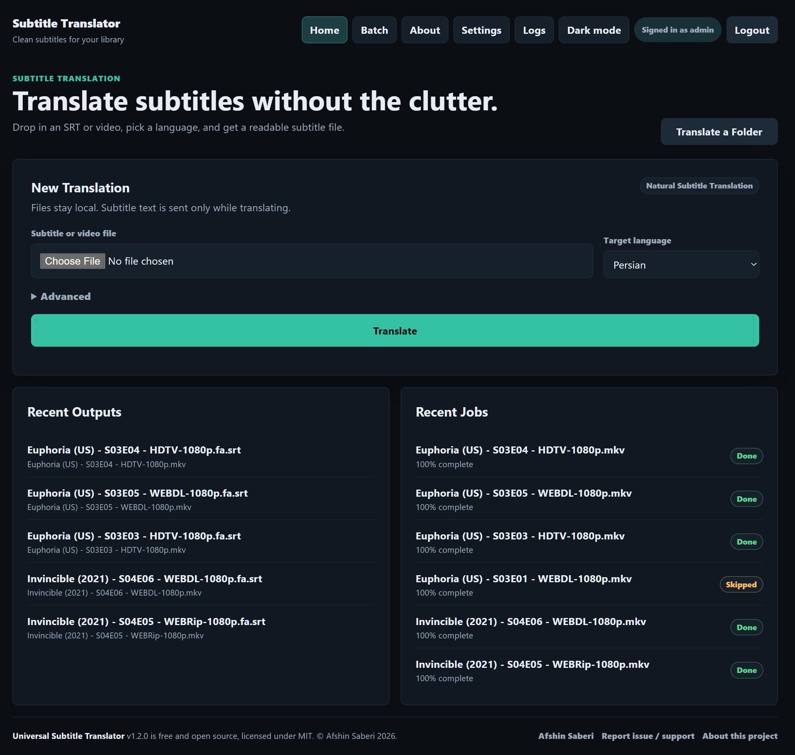
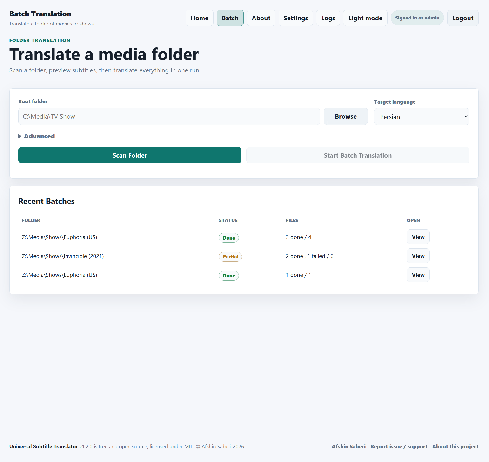
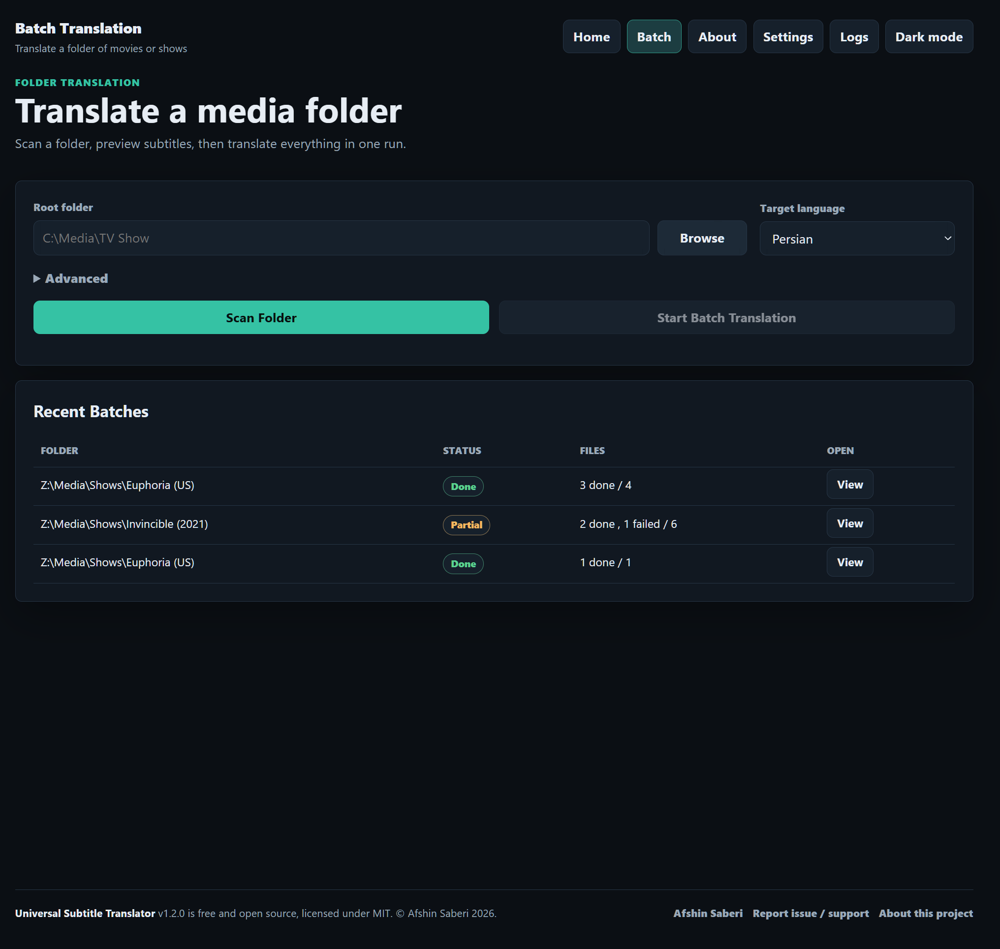
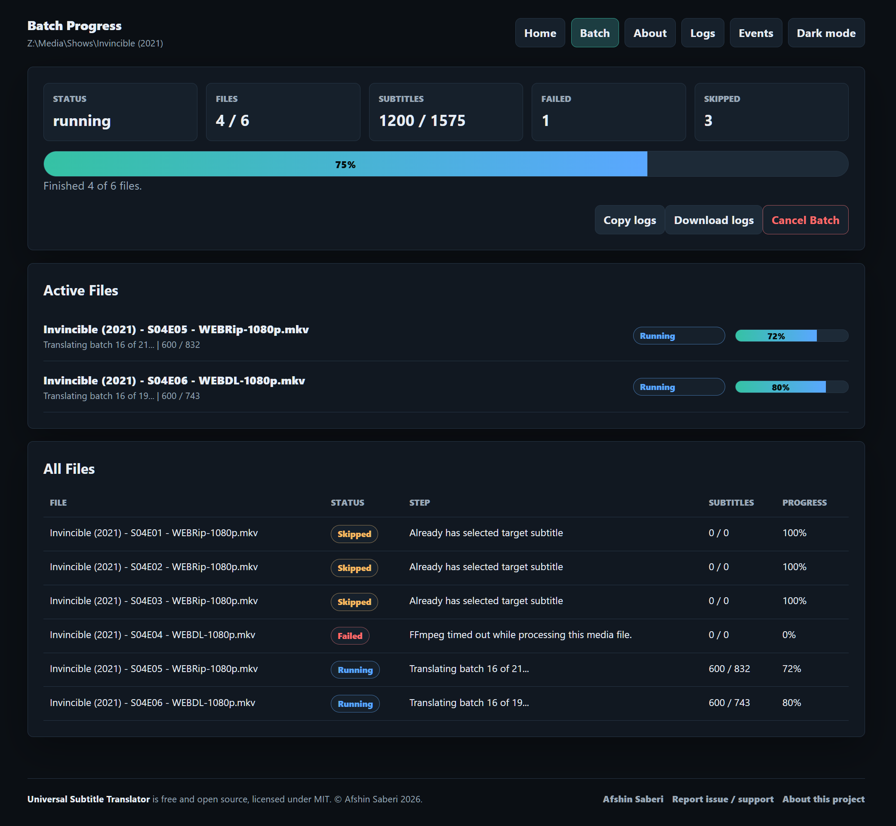
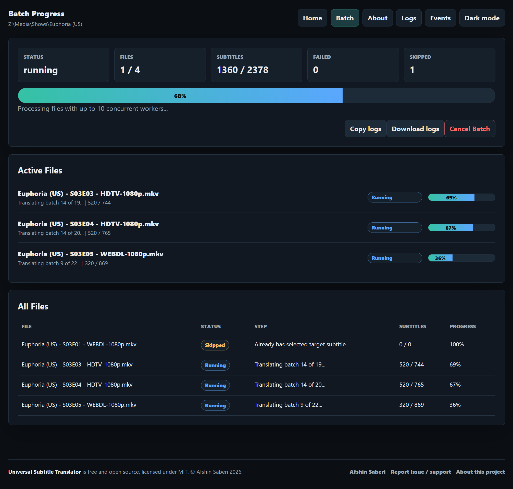
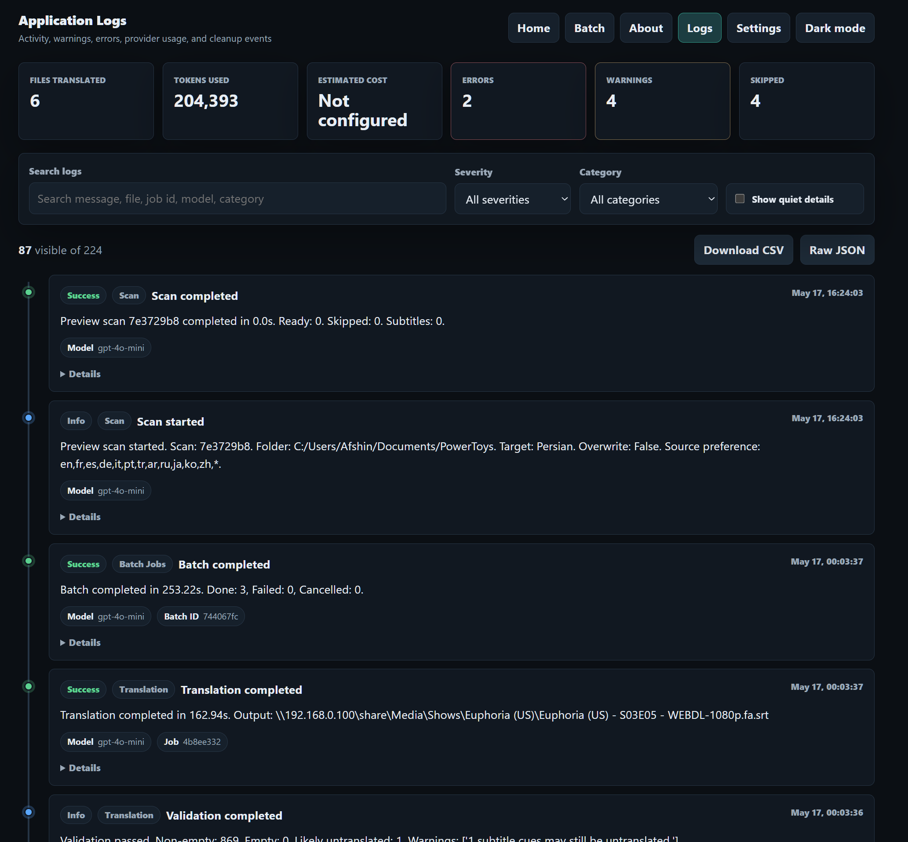
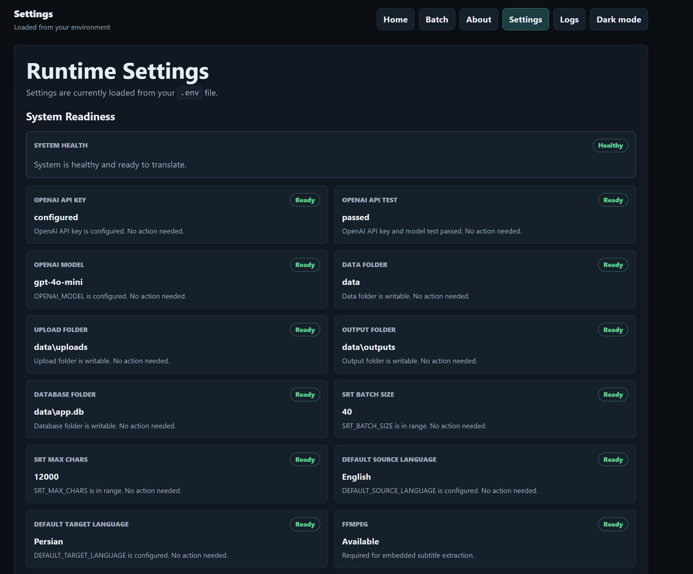
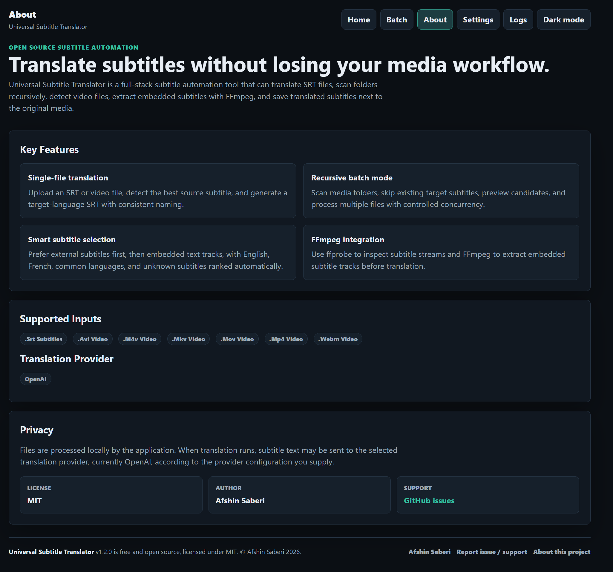

# Universal Subtitle Translator


A full-stack subtitle automation tool for translating SRT files and media folders into Persian and other languages.

Current version: `1.3.0`

## Features

- Single-file upload for `.srt` subtitles and common video files.
- Recursive folder batch translation.
- Smart source subtitle selection: external subtitles first, then embedded text tracks.
- Automatic source language detection.
- FFmpeg/ffprobe subtitle stream inspection and extraction.
- OpenAI-powered translation with configurable model, target language, and style.
- Live progress, cancellation, logs, and downloadable batch reports.
- Dark/light themed FastAPI + Jinja UI.
- SQLite job history and Docker Compose deployment.

## Screenshots

| Home | Light mode |
| --- | --- |
|  |  |

| Batch setup | Batch running |
| --- | --- |
|  |  |

| Batch details | Logs |
| --- | --- |
|  |  |

| Settings | About |
| --- | --- |
|  |  |

## Docker

Run the app with separate frontend and backend containers:

```bash
docker compose up --build
```

Then open:

```text
http://localhost:2288
```

Services:

- `frontend`: Nginx public entrypoint on port `2288`, proxying requests to the backend.
- `backend`: FastAPI app on the internal Docker network at port `2288`.

Both services include Docker healthchecks. Persistent app data is mounted from `./data` into `/app/data` in the backend container.

For translation, create a local `.env` file and set your OpenAI key:

```bash
cp .env.example .env
```

```text
OPENAI_API_KEY=REPLACE_YOUR_API_WITH_THIS_TEXT
```

The app can still start without `.env`; it will show a setup warning and block translation until the key is configured. Do not commit `.env`.

Useful Docker commands:

```bash
docker compose config --no-interpolate
docker compose build
docker compose up
docker compose logs -f
docker compose down
```

Use `docker compose config --no-interpolate` for diagnostics. Plain `docker compose config` may print values loaded from your local `.env`, including secrets.

## Configuration

Copy `.env.example` to `.env`, then set:

```text
OPENAI_API_KEY=REPLACE_YOUR_API_WITH_THIS_TEXT
```

Useful settings:

- `APP_VERSION`: semantic application version, current `1.3.0`.
- `OPENAI_MODEL`: translation model.
- `HOST_PORT`: public Docker Compose port on your machine, default `2288`.
- `AUTH_ENABLED`: set to `true` to require admin login for the UI and API.
- `ADMIN_USERNAME`: admin login username.
- `ADMIN_PASSWORD`: admin login password. Use a strong unique value.
- `SESSION_SECRET`: random 32+ character value used to sign session cookies.
- `MEDIA_ROOT`: optional backend-accessible root folder for batch scans.
- `TEMP_DIR`: app-managed temporary files, safe to clear from Settings.
- `MAX_UPLOAD_MB`: single upload limit.
- `BATCH_FILE_CONCURRENCY`: concurrent files in batch mode, capped at 10.
- `FFMPEG_TIMEOUT_SECONDS`: ffmpeg/ffprobe timeout.

## Authentication

Authentication is off by default for trusted local use. To protect the UI and API, enable admin login in `.env`:

```text
AUTH_ENABLED=true
ADMIN_USERNAME=admin
ADMIN_PASSWORD=admin
SESSION_SECRET=REPLACE_YOUR_SESSION_SECRET_WITH_THIS_TEXT
```

Generate a session secret with:

```bash
python -c "import secrets; print(secrets.token_urlsafe(48))"
```

Restart the app after changing auth settings. When enabled, all UI and API routes require login except `/login`, `/logout`, `/health`, and static assets used by the login page.

The default login is `admin` / `admin`. The app will show a warning while the default password is still in use. Change `ADMIN_PASSWORD` before exposing the app beyond your own machine.

## Batch Translation

Open:

```text
http://localhost:2288/batches
```

Enter a root folder path that the backend can access. The app scans subfolders recursively for common video files, prefers external `.srt` subtitles next to each video, falls back to extractable embedded subtitles through ffprobe/ffmpeg, previews files before starting, then translates with controlled file concurrency.

Output naming uses the video base name plus the target language code:

```text
Movie.mkv    -> Movie.fa.srt
Movie.en.srt -> Movie.fa.srt
```

Existing target-language subtitles are skipped unless overwrite is enabled.

When running in Docker, mount the media folder into the backend container before scanning it. For example, add a volume such as `/srv/media:/media:ro` to the backend service, set `MEDIA_ROOT=/media`, then scan `/media/Show`.

Example compose volume for media folders:

```yaml
services:
  backend:
    volumes:
      - ./data:/app/data
      - /srv/media:/media:ro
    environment:
      MEDIA_ROOT: /media
```

## Docker Hub

Build and publish the two runtime images with your Docker Hub namespace:

```bash
docker login
APP_VERSION=1.3.0
docker build -t YOUR_DOCKERHUB_USERNAME/universal-subtitle-translator-backend:${APP_VERSION} -t YOUR_DOCKERHUB_USERNAME/universal-subtitle-translator-backend:latest ./backend
docker build -t YOUR_DOCKERHUB_USERNAME/universal-subtitle-translator-frontend:${APP_VERSION} -t YOUR_DOCKERHUB_USERNAME/universal-subtitle-translator-frontend:latest ./frontend
docker push YOUR_DOCKERHUB_USERNAME/universal-subtitle-translator-backend:${APP_VERSION}
docker push YOUR_DOCKERHUB_USERNAME/universal-subtitle-translator-backend:latest
docker push YOUR_DOCKERHUB_USERNAME/universal-subtitle-translator-frontend:${APP_VERSION}
docker push YOUR_DOCKERHUB_USERNAME/universal-subtitle-translator-frontend:latest
```

On a server that should pull images instead of building them locally, use:

```bash
DOCKERHUB_NAMESPACE=YOUR_DOCKERHUB_USERNAME IMAGE_TAG=1.3.0 docker compose -f docker-compose.hub.yml up -d
```

## Releases

This project uses semantic versioning: `MAJOR.MINOR.PATCH`.

- Increment `PATCH` for backward-compatible fixes.
- Increment `MINOR` for backward-compatible features.
- Increment `MAJOR` for breaking changes.

For a release, update `VERSION`, `APP_VERSION` in `.env.example`, and any README version examples to the same value. Commit the change, then create a matching Git tag:

```bash
APP_VERSION=1.3.0
git add VERSION .env.example README.md docker-compose.yml docker-compose.hub.yml backend/app/config.py
git commit -m "Release v${APP_VERSION}"
git tag -a "v${APP_VERSION}" -m "Release v${APP_VERSION}"
git push origin main
git push origin "v${APP_VERSION}"
```

## Tests

From the backend folder:

```bash
python -m pip install -r requirements-dev.txt
python -m pytest tests
```

The current lightweight tests cover media-scanner decisions such as target subtitle skips, external subtitle priority, embedded subtitle priority, and overwrite behavior.

## Privacy

Files are processed locally by the app. Subtitle text may be sent to the selected translation provider during translation.

## License

This project is licensed under the MIT License.
© 2026 Afshin Saberi.
